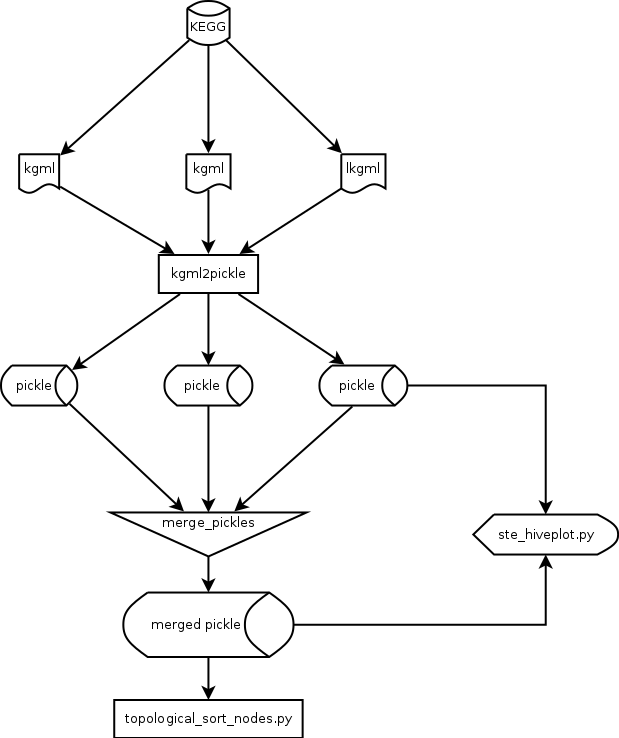

# pxat

## Pathway X-talk Analysis Toolkit

Algunas funcionalidades que pretendemos:

- PXAT hace Redes a partir de pathways.

- Anota esas redes como clasificando los nodos por sus ubicaciones en el
  grafo dirigido.

- Identifica trayectorias en la red

- Identifica sitios de X-talk entre pathways.

- Saca subredes a partir de pathways.

- Identificará subtrayectorias compartidas.

- Identificará el tipo de X-talk en función de los edges que lo rodean
  (activadores, represores, etc.)

- Integrará datos experimentales (de expresión génica)

- Identificará tipos de X-talk en función de la expresión.

- Aplicará enrichment analisis.

- Simulación basada en agentes.

Some nice visualizations we might grab:

https://christophergandrud.github.io/networkD3/

